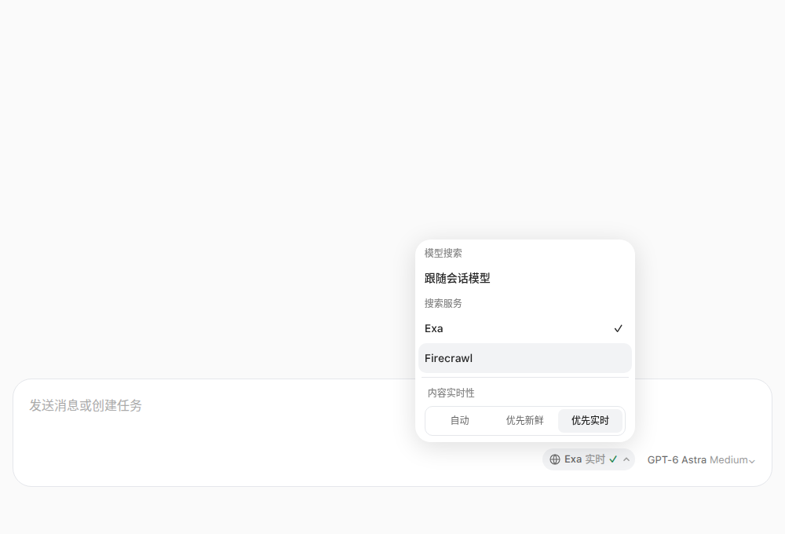
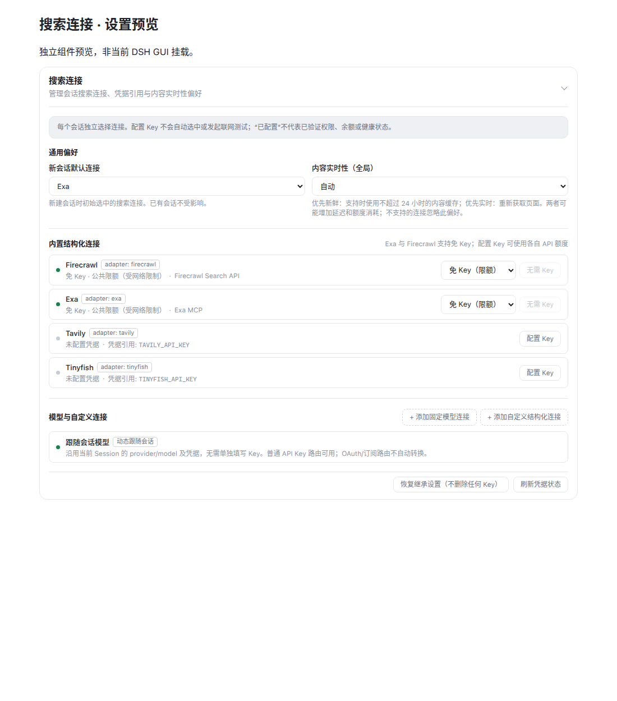

<div align="center">


# Web Search Enhanced

**聊天用喜欢的模型，搜索用合适的连接。**

为 [DeepSeek Harness (DSH)](https://github.com/deepseek-ai/deepseek-harness) 打造的增强型联网搜索插件。开箱即用免 Key 起步，支持在每段对话中自由搭配最适合的搜索引擎与实时性偏好。

[](https://github.com/Yurzi/dsh-web-search-enhanced/releases)
[](LICENSE)
[](package.json)
[](package.json)

[🚀 快速上手](#-快速上手) · [✨ 核心特性](#-核心特性) · [🔍 搜索引擎推荐](#-选哪种搜索服务) · [⚙️ 进阶配置](#️-进阶配置与个人-key) · [❓ 常见问题](#-常见问题-faq) · [📖 详细文档](#-想了解更多)

</div>

---

## ✨ 核心特性

- 🐋 **开箱即用，免 Key 起步**：无需繁琐申请 API Key，安装默认选用 Exa 免 Key 检索，同时内置 Firecrawl、Tavily 与 Tinyfish，安装即刻体验联网搜索。
- 🔀 **搜索与聊天自由解耦**：模型聊天与联网搜索互不干扰！无论你当前在与 Claude、GPT 还是本地模型对话，都可以随时为当前会话指定最擅长该领域的搜索引擎。
- 💬 **会话级记忆与独立分支**：每段对话都会记住各自选用的搜索服务与实时性偏好；Fork 分支对话互不冲突，各自独立调整。
- ⚡ **内容实时性自由掌控**：在输入区一键切换「自动 / 优先新鲜 / 优先实时」，随心平衡网页检索速度与最新内容抓取。
- 🔐 **安全优雅的凭据隔离**：深度接入 DSH 原生 Credentials 体系，敏感 API Key 安全留存于凭据管理器中，绝不污染项目配置文件。
- 🎨 **无缝融入原生界面**：聊天输入框随手弹出的快捷切换胶囊 + 直观清爽的插件设置面板，自适应浅色/深色主题与移动端窄屏。

---

## 📸 界面预览

### 💬 会话快捷选择器（在聊天框随手切换）

> 在输入框工具栏轻轻一点，即可随时为当前会话切换搜索引擎与内容实时性，无需跳转设置，不打断对话灵感。

<p align="center">
  
</p>
<p align="center">
  <sub>切换视图：<b>桌面浅色（上图）</b> · <a href="docs/assets/search-picker-dark.png">桌面深色</a> · <a href="docs/assets/search-picker-narrow.png">移动窄屏</a></sub>
</p>

### ⚙️ 统一插件设置中心

> 集中管理默认连接、免 Key / 个人 Key 访问模式、凭据引用与自定义模型端点。

<p align="center">
  
</p>
<p align="center">
  <sub>切换视图：<b>桌面浅色（上图）</b> · <a href="docs/assets/settings-dark.png">桌面深色</a> · <a href="docs/assets/settings-mobile.png">移动窄屏</a></sub>
</p>

---

## 🚀 快速上手

### 环境要求

- **DeepSeek Harness**：≥ `0.1.5-rc.2`
- **Node.js**：`^22.19.0 || >=24.0.0`

### 步骤 1：安装插件

**方式 A：通过 GitHub Release 离线包安装（推荐）**

从 [v0.1.1 Release](https://github.com/Yurzi/dsh-web-search-enhanced/releases/tag/v0.1.1) 下载预构建包 `dsh-web-search-enhanced-0.1.1.tgz`，执行绝对路径安装命令：

```sh
dsh plugin --profile web add /path/to/dsh-web-search-enhanced-0.1.1.tgz
```

**方式 B：通过 npm 在线安装**

在版本已发布到 npm 仓库后，也可直接安装：

```sh
dsh plugin --profile web add dsh-web-search-enhanced@0.1.1
```

### 步骤 2：生效与刷新

1. 重载插件或重启 DSH 服务端。
2. 刷新浏览器 Web 页面，确保前端客户端组件与后端服务同步更新。

### 步骤 3：立即提问体验

新建一段会话，输入框上方默认已为你准备好 **Exa · 免 Key** 搜索连接。直接向 AI 提问：

> 💡 **提问示例**：“搜索最近的 TypeScript 发布说明，总结最重要的几个变化并附上引用来源。”

AI 会自动通过 Web Search Enhanced 检索最新网络资料，并附带网页来源回答你！

---

## 🔍 选哪种搜索服务？

Web Search Enhanced 内置了多种主流检索服务与模型搜索能力，你可以按需随心选择：

| 搜索连接         | 推荐场景                        | 访问模式                       | 特点说明                                                                          |
| :--------------- | :------------------------------ | :----------------------------- | :-------------------------------------------------------------------------------- |
| **Exa** _(默认)_ | 💻 开发者、技术文档、论文研究   | 免 Key (开箱即用) / 个人 Key   | 强大的语义神经检索，对编程与深度学术内容理解极准；个人 Key 支持配置搜索类型       |
| **Firecrawl**    | 📰 新闻资讯、深度文章抓取       | 免 Key (开箱即用) / 个人 Key   | 擅长清洗和抓取干净的 Markdown 网页正文；支持优先获取最新页面                      |
| **Tavily**       | 🔍 事实核查、行业调研、综合检索 | 免 Key (开箱即用) / 个人 Key   | 专为大语言模型打造的搜索服务，支持自定义搜索深度（快速/进阶）与新闻主题           |
| **Tinyfish**     | 🌍 跨语言搜索、地域本地化资讯   | 免 Key (开箱即用) / 个人 Key   | 支持按国家地区、特定语言和搜索用途精准过滤检索范围                                |
| **专用搜索模型** | 🤖 统一使用特定支持联网的模型   | Anthropic / OpenAI 协议        | 通过服务端搜索能力（如 OpenAI Responses、Anthropic Messages）直接返回带引用的回答 |
| **跟随会话模型** | 🔄 懒人模式，搜索使用当前模型   | 需配置 provider 的 `apiKeyEnv` | 自动沿用当前会话选定的模型与端点发起联网搜索                                      |

> 💡 **关于免 Key 访问**：
> 免 Key 模式走的是上游提供的公共接入通道，省去了新用户申请注册 API Key 的繁琐步骤。
> 公共通道可能因高峰期并发或网络 IP 受限；如遇限流，可以在输入框临时切换到其他免 Key 连接（如 Tavily / Firecrawl），或者在设置中配置自己的专属 API Key。

---

## ⏱️ 内容实时性说明

在聊天输入框的搜索菜单中，你可以为当前会话设置**内容实时性**：

- **自动 (Auto)**：采用搜索引擎默认的缓存与检索策略，响应快速。
- **优先新鲜 (Fresh)**：优先使用不超过 24 小时的较新网页缓存（Firecrawl / Exa 个人 Key 支持）。
- **优先实时 (Realtime)**：发起重新爬取，获取页面当前时刻的最新内容（适合突发新闻、最新行情等时效极高的场景）。

_注：实时抓取可能会稍微增加检索耗时与额度消耗；对于不支持实时性控制的连接，系统会自动保留偏好并优雅回退至默认检索。_

---

## ⚙️ 进阶配置与个人 Key

如果你拥有各平台专属的 API Key，或想要自定义专用搜索模型，只需打开 **设置 → 插件 → Web Search Enhanced**：

1. **绑定个人 API Key**：
   - 找到目标连接（例如 Firecrawl 或 Tavily）。
   - 在凭据输入框填入你的 API Key，点击保存（将自动存入 DSH Credentials，安全可靠）。
   - 将“访问方式”从“免 Key”切换为“个人 Key”。
2. **设置新会话默认连接**：
   - 在“新会话默认连接”下拉框中选择你最常用的引擎，新创建的对话将自动应用该偏好。
3. **添加自定义模型或端点**：
   - 支持添加任意兼容 OpenAI 或 Anthropic 服务端搜索协议的模型端点。

完整配置语法与高级参数白名单，请参阅 📖 [详细配置指南](docs/configuration.zh-CN.md)。

---

## ❓ 常见问题 (FAQ)

<details>
<summary><b>Q1: 搜索时提示 <code>WEB_SEARCH_NOT_SELECTED</code>？</b></summary>

**原因**：当前会话没有选定任何搜索连接。  
**解决办法**：在输入框右侧工具栏点击搜索图标/胶囊，在弹出的菜单中勾选任意一个搜索服务（如 Exa 或 Firecrawl）；或者在插件设置中为“新会话默认连接”指定一个默认引擎。
</details>

<details>
<summary><b>Q2: 免 Key 搜索突然提示失败或限流（<code>WEB_KEYLESS_UNAVAILABLE</code> / <code>WEB_PROVIDER_RATE_LIMITED</code>）？</b></summary>

**原因**：免 Key 服务基于上游公共节点，高峰时段或特定网络 IP 可能触发临时频率限制。  
**解决办法**：

1. 在会话输入框中快速切换到另一个免 Key 引擎（如从 Exa 换到 Firecrawl 或 Tavily）。
2. 在设置中为该引擎填入你自己的官方 API Key，并将访问方式切换为“个人 Key”。

</details>

<details>
<summary><b>Q3: 我在设置中填了 API Key，为什么搜索依然是免 Key 模式？</b></summary>

**原因**：为了防止意外产生付费额度消耗，插件设计了“显式切换保护”——保存 Key 并不会自动切换通道。  
**解决办法**：在设置页该连接的卡片上，将下拉选项由 **免 Key** 手动切换为 **个人 Key (API Key)** 即可。
</details>

<details>
<summary><b>Q4: 我在会话中修改了搜索引擎，会影响其他会话吗？Fork 对话呢？</b></summary>

**不会**。Web Search Enhanced 是完全**会话隔离**的：

- 修改当前会话的搜索连接，不会影响已经存在的其他会话。
- Fork（分支）出的新会话会继承分支那一刻的搜索设置，之后两者独立变更，互不干扰。

</details>

<details>
<summary><b>Q5: 如何从 0.0.x 旧版本平滑升级？</b></summary>

进入 **设置 → 插件 → Web Search Enhanced**，系统会自动检测旧版全局模型配置并弹出“导入旧配置”提示，一键点击即可无缝映射为新版连接配置。详细注意事项请参阅 📖 [升级指南](docs/migration.zh-CN.md)。
</details>

---

## 📖 想了解更多？

| 文档                                                     | 适合谁读            | 主要内容                                                          |
| :------------------------------------------------------- | :------------------ | :---------------------------------------------------------------- |
| 📘 **[配置指南](docs/configuration.zh-CN.md)**           | 所有用户 / 进阶用户 | 完整参数列表、凭据机制、高级 options 白名单、自定义端点与排错字典 |
| 📙 **[升级指南](docs/migration.zh-CN.md)**               | 从旧版升级的老用户  | 0.1.0 架构变化、旧版导入指引、升级踩坑预防                        |
| 📗 **[架构设计说明](docs/design-v2.converged.zh-CN.md)** | 开发者 / 架构爱好者 | 会话状态隔离、请求快照机制、多适配器与安全性设计                  |
| 🛠️ **[开发与验证文档](docs/v2-implementation.zh-CN.md)** | 插件二次开发者      | 本地构建、单元测试、浏览器环境验证与打包发布                      |
| 📝 **[更新日志](CHANGELOG.md)**                          | 所有人              | 版本演进记录与历史变更                                            |

---

## 💬 问题反馈

如果在使用过程中遇到问题，欢迎前往 [GitHub Issues](https://github.com/Yurzi/dsh-web-search-enhanced/issues) 提交反馈。  
_提示：提 issue 时请附上 DSH 版本、插件版本及报错简述，并请注意**脱敏**，切勿粘贴个人 API Key 或私密对话内容。_

---

## 🤝 致谢与许可

- 本项目代码遵循 [MIT](LICENSE) 开源协议。
- 衷心感谢 [DeepSeek Harness](https://github.com/deepseek-ai/deepseek-harness) 团队及各搜索服务（Exa、Firecrawl、Tavily、Tinyfish 等）的开发者。
- **关于横幅形象**：Banner 中的 DeepSeek 鲸鱼娘形象来源于 **上善无形原创角色与 ZipZipPipe 二创**；本项目横幅基于用户提供的参考图经 AI 辅助创作。角色与参考作品的著作权利均归原作者所有，不因本项目代码的 MIT 许可而获得再授权，亦不代表官方背书。
